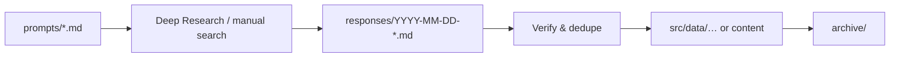

# Research

Working area for curated research that feeds the site — prompts, pasted tool outputs, and archives.

**Convention:** all research markdown lives here. Agents are instructed via `.cursor/rules/research-pipeline.mdc` to follow this layout.

## Layout

```text
research/
├── README.md                 ← you are here
└── <topic>/
    ├── README.md             ← topic-specific pipeline
    ├── prompts/              ← copy-paste prompts for Deep Research, etc.
    ├── responses/            ← pasted outputs (user + agents)
    └── archive/              ← responses already shipped to the site
```

## Workflow



1. **Prompt** — pick or refine a file in `<topic>/prompts/`.
2. **Run** — paste into Google Deep Research (or run manually).
3. **Store** — save the full response in `<topic>/responses/YYYY-MM-DD-<slug>.md`.
4. **Harvest** — verify links, dedupe, normalize into site data.
5. **Archive** — move the response to `<topic>/archive/` after publishing.

## Response template

Create new response files from `responses/_template.md`.

## Topics

| Topic | Purpose | Site output |
| ----- | ------- | ----------- |
| [opportunities](./opportunities/) | PH opportunity newsletter curation | `src/data/opportunities.js` |
